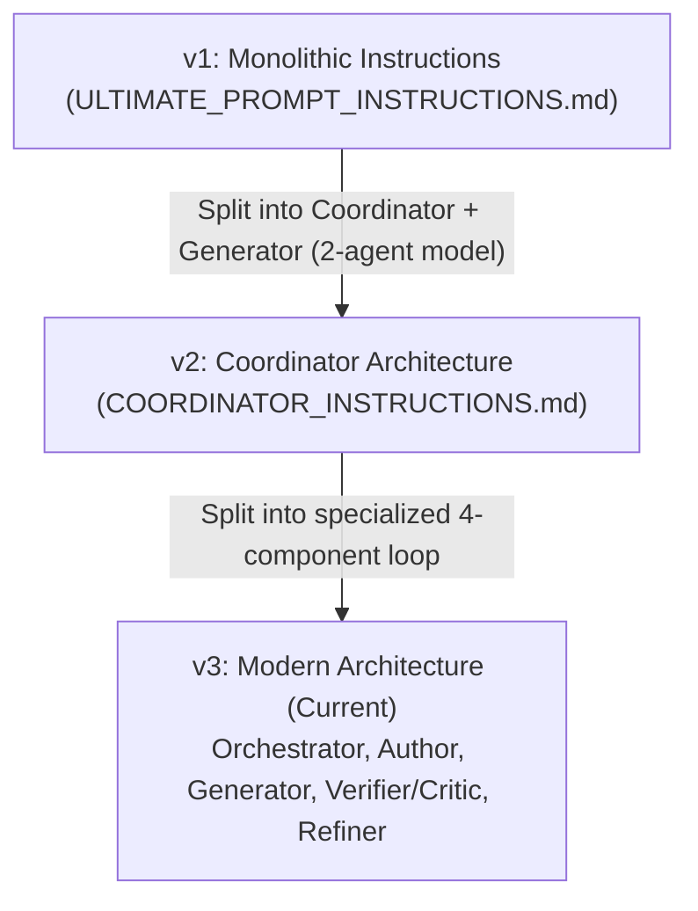

# Archived Instructions

This directory preserves earlier iterations of the **Ultimate Prompt** instruction architecture for historical reference and provenance.

---

## Evolution Timeline

---

## Document History & Metadata

### 1. `ULTIMATE_PROMPT_INSTRUCTIONS.md` (v1 — Initial Version)
* **Historical Context**: The very first version of the system.
* **Architecture**: Single monolithic document defining both the concept of the "Ultimate Prompt" and a single-agent iterative loop where one agent managed the entire process from analysis to generation and verification.
* **Superseded By**: `COORDINATOR_INSTRUCTIONS.md`.

### 2. `COORDINATOR_INSTRUCTIONS.md` (v2 — Two-Agent Model)
* **Historical Context**: Created to separate the cognitive roles of "planning/criticism" from "execution".
* **Architecture**:
  * **Coordinator**: Analyzed the original codebase, created the initial prompt, judged code, wrote diff reports, and refined prompts.
  * **Generator**: A dedicated isolated worker that received only prompt candidates via a shared CNS handoff directory (`STATE` protocol).
* **Superseded By**: The modern 4-component split under `instructions/`:
  1. [`ORCHESTRATOR_INSTRUCTIONS.md`](../ORCHESTRATOR_INSTRUCTIONS.md) — Pure loop control, handoffs, and sequencing (no cognitive evaluation).
  2. [`PROMPT_AUTHOR_INSTRUCTIONS.md`](../PROMPT_AUTHOR_INSTRUCTIONS.md) — Initial analysis, Prompt v0, and test suite creation (iteration 0 only).
  3. [`GENERATOR_INSTRUCTIONS.md`](../GENERATOR_INSTRUCTIONS.md) — Clean code synthesis from isolated prompt.
  4. [`VERIFIER_CRITIC_INSTRUCTIONS.md`](../VERIFIER_CRITIC_INSTRUCTIONS.md) — Behavioral verification, capability diffs, and root-cause critique.
  5. [`PROMPT_REFINER_INSTRUCTIONS.md`](../PROMPT_REFINER_INSTRUCTIONS.md) — Structurally independent prompt refinement based on critique.
  6. [`LEARNINGS.md`](../LEARNINGS.md) — Global cross-cutting learnings.
